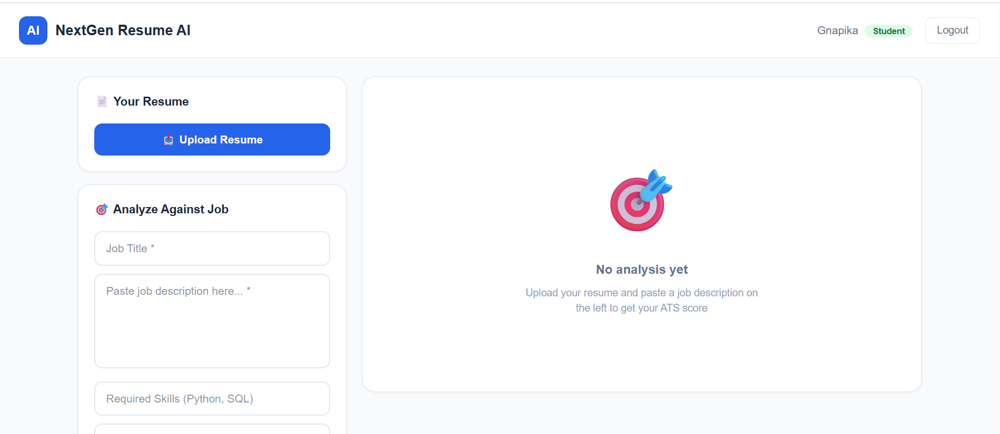
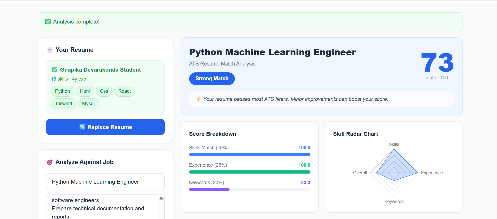
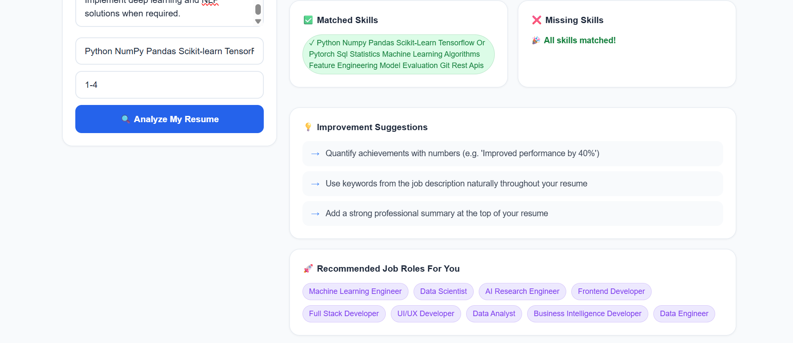
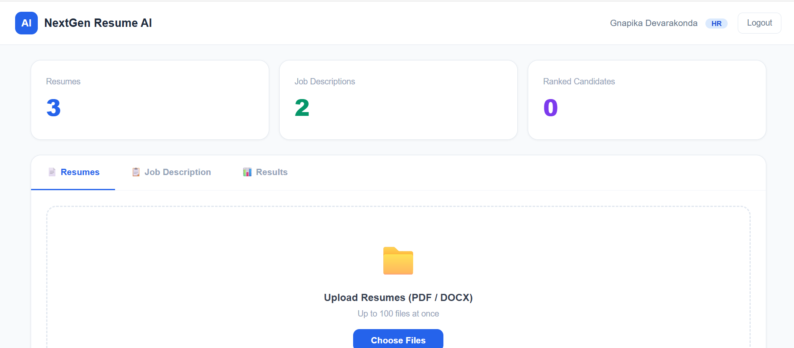
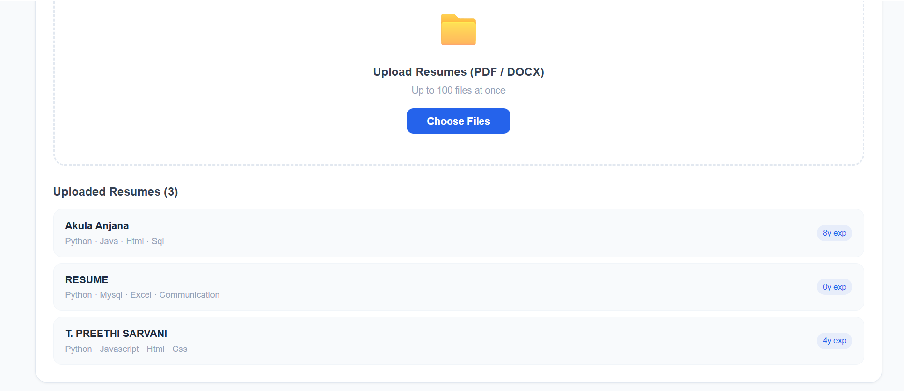
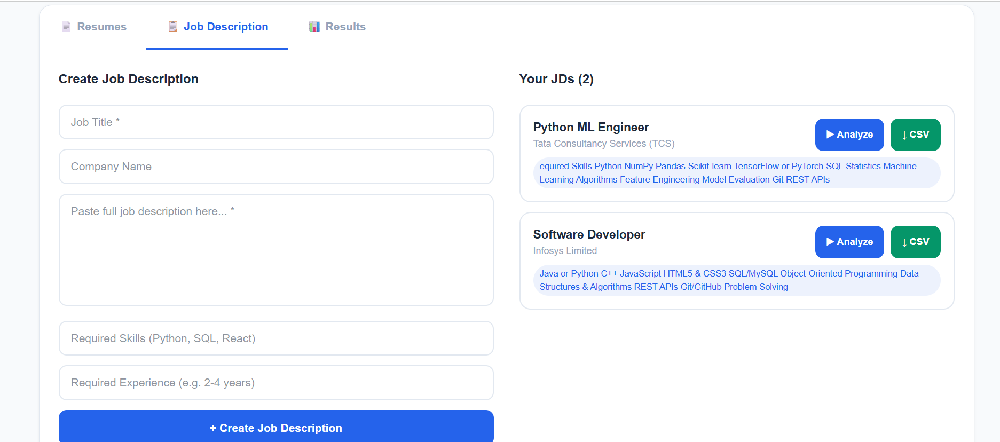
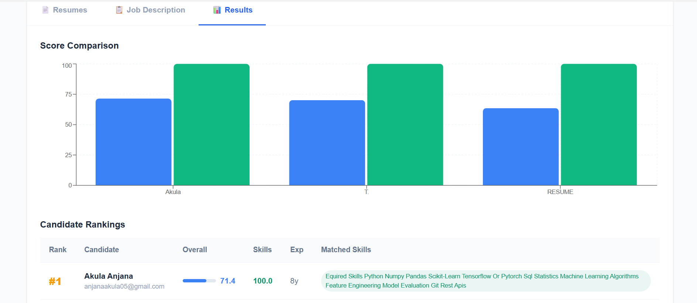

#  NextGen Resume Intelligence

> **AI-powered Resume Analysis and Candidate Ranking System built using FastAPI, React, PostgreSQL, NLP, and Power BI.**

Developed as a **Mini Project** at **Stanley College of Engineering and Technology for Women**.

---

##  Project Overview

NextGen Resume Intelligence is an AI-powered recruitment platform that streamlines the hiring process by automatically analyzing resumes against job descriptions.

The application provides separate dashboards for **Students** and **HR Recruiters**.

Students can upload their resumes and receive an ATS compatibility score along with personalized improvement suggestions, while HR professionals can upload multiple resumes, create job descriptions, compare candidates, and rank applicants based on their suitability for a role.

---

#  Key Features

##  Student Module

-  Secure Login & Authentication
-  Upload Resume (PDF)
-  ATS Resume Score (Out of 100)
-  Resume Skill Extraction
-  Skill Radar Chart
-  Resume Improvement Suggestions
-  Recommended Job Roles
-  Score Breakdown Analysis

---

##  HR Module

-  Secure Login
-  Upload Multiple Resumes
-  Create & Manage Job Descriptions
-  Resume Parsing
-  Skill Matching
-  Candidate Comparison
-  Candidate Ranking
-  Export Results to CSV

---

##  Analytics

- PostgreSQL Database
- Power BI Dashboard
- Resume Statistics
- Candidate Ranking Analytics

---

#  Tech Stack

## Frontend

- React
- Vite
- HTML5
- CSS3
- JavaScript

## Backend

- Python
- FastAPI
- REST APIs

## Database

- PostgreSQL

## AI / NLP

- Resume Parsing
- Skill Extraction
- ATS Score Calculation
- Keyword Matching

## Analytics

- Power BI

---

# Project Structure

```text
NextGen Resume Intelligence
│
├── backend/
│   ├── app/
│   │   ├── models/
│   │   ├── routes/
│   │   ├── schemas/
│   │   ├── services/
│   │   └── utils/
│   │
│   ├── requirements.txt
│   └── run.py
│
├── frontend/
│
├── screenshots/
│
├── docs/
│
├── README.md
└── .gitignore
```

---

#  Workflow

### Student Workflow

1. Register/Login
2. Upload Resume
3. Enter Job Description
4. ATS Score is calculated
5. Resume is analyzed
6. Improvement suggestions are generated
7. Recommended job roles are displayed

---

### HR Workflow

1. Login
2. Upload Multiple Resumes
3. Create Job Description
4. Resume Parsing
5. Candidate Comparison
6. Resume Ranking
7. Export Results

---

#  Application Screenshots

##  Login Page


---

#  Student Module

### Student Dashboard



### ATS Resume Analysis



### Resume Improvement Suggestions



---

#  HR Module

### HR Dashboard



### Resume Upload



### Job Description Management



### Candidate Ranking



---

# Installation

## Clone Repository

```bash
git clone https://github.com/Gnapika07/nextgen-resume-intelligence.git
```

---

## Backend Setup

```bash
cd backend

pip install -r requirements.txt

python run.py
```

---

## Frontend Setup

```bash
cd frontend

npm install

npm run dev
```

---

#  Project Highlights

- AI-powered Resume Analysis
- ATS Resume Scoring
- Resume Parsing
- NLP-based Skill Extraction
- Candidate Ranking
- Student Dashboard
- HR Dashboard
- Authentication System
- PostgreSQL Integration
- Power BI Analytics
- CSV Export

---

#  Future Improvements

The next version of this project will include:

- Semantic Resume Matching using Sentence Transformers
- AI-powered Resume Recommendations
- Advanced Recruiter Dashboard
- Cloud Deployment
- Docker Support
- CI/CD Pipeline
- Enhanced Authentication & Authorization
- Improved UI/UX
- API Documentation with Swagger
- Advanced Analytics Dashboard

---

#  Contributors

- **Devarakonda Gnapika**
- **A. Anjana**
- **A. Bindu**

**Mini Project**

Stanley College of Engineering and Technology for Women

---

#  License

This project is developed for educational and portfolio purposes.

---